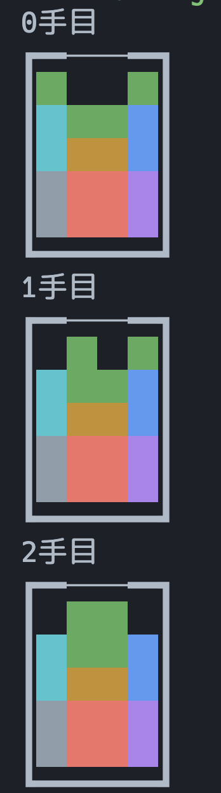
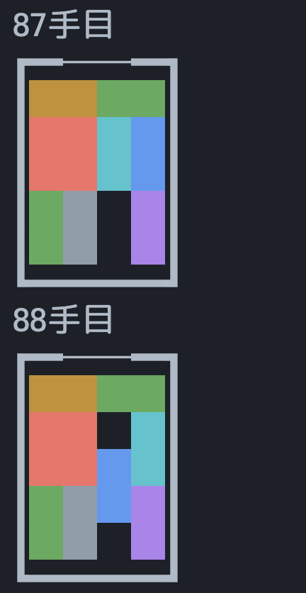

# 箱入り娘

[箱入り娘](https://ja.wikipedia.org/wiki/%E7%AE%B1%E5%85%A5%E3%82%8A%E5%A8%98_(%E3%83%91%E3%82%BA%E3%83%AB))を解きます．

## 使い方

このディレクトリで

```sh
$ cargo run
```

を実行すると，初期状態からの手順が順に表示されます．

## 注意

- 緑のマスはそれぞれ別の駒です
  


- 隣接する状態で，色は保存されません．


